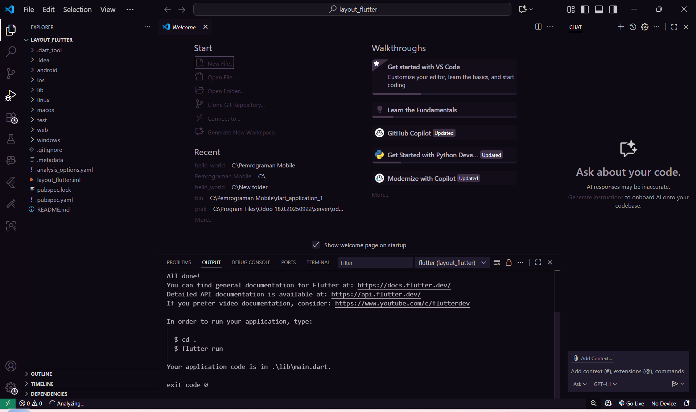
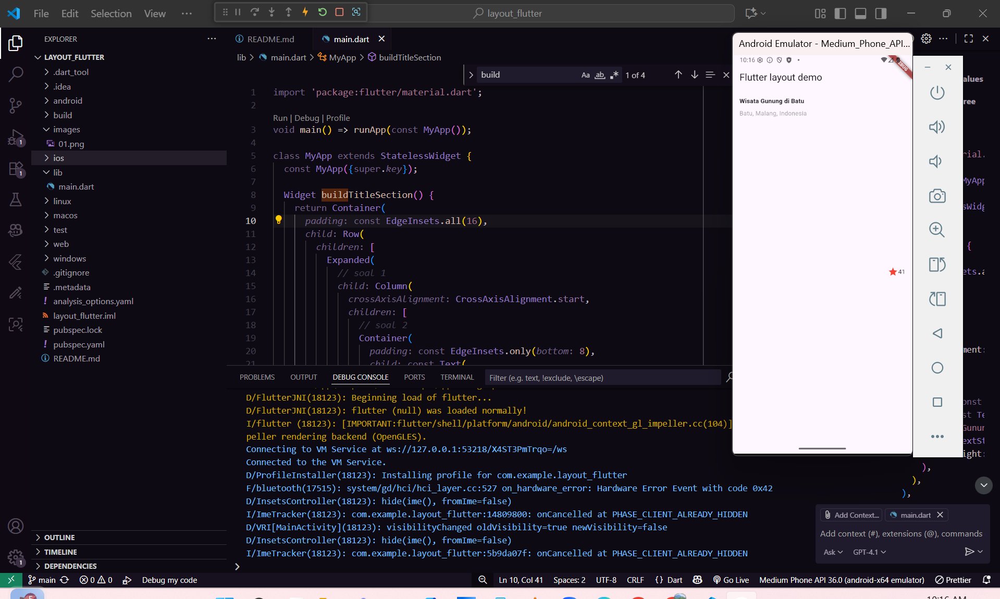
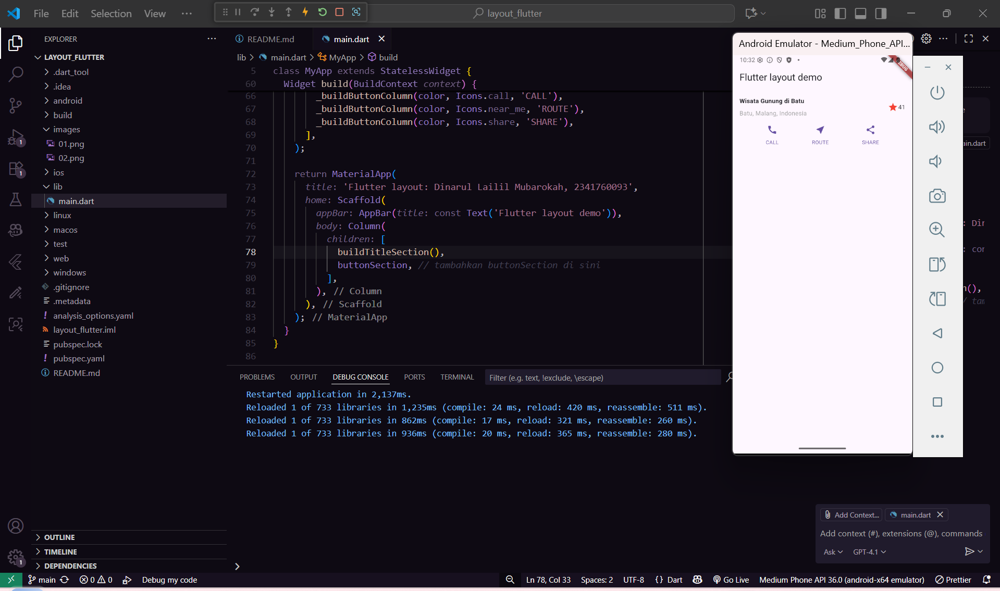
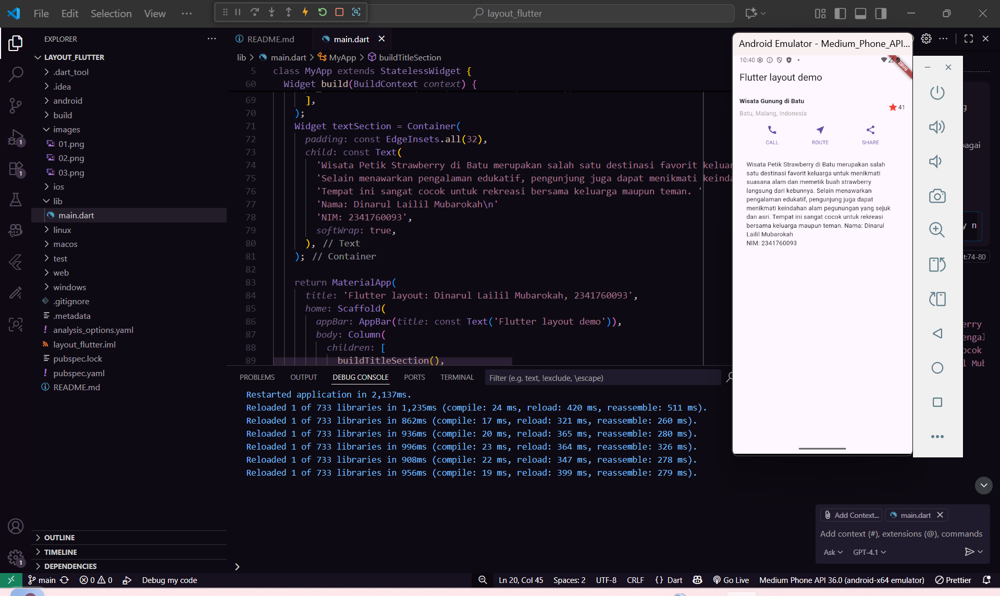
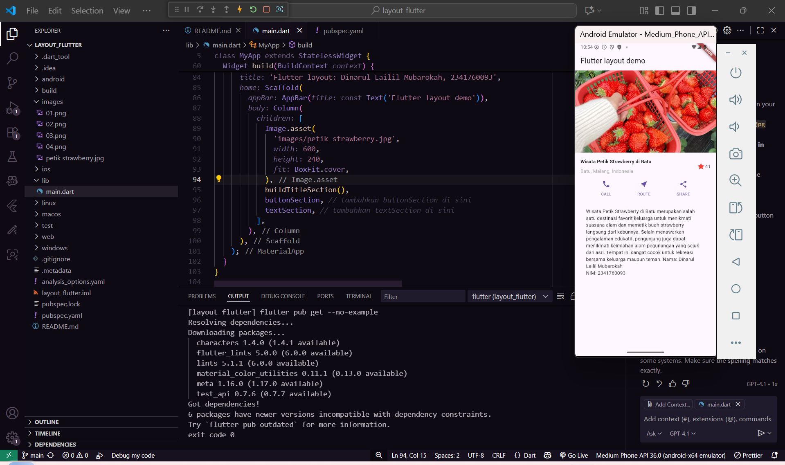

# layout_flutter

A new Flutter project.

1. membuat project baru bernama layout_flutter
    

2. implementasi tittle row
  

3. Layout terdiri dari judul, lokasi, ikon bintang dengan jumlah rating, serta tiga tombol aksi (CALL, ROUTE, SHARE) yang ditampilkan secara horizontal. Kode menggunakan widget Column dan Row untuk mengatur tata letak secara vertikal dan horizontal.
 

4. Bagian ini menggunakan widget Text di dalam Container dengan padding agar teks lebih mudah dibaca dan tampak rapi pada tampilan aplikasi.
 

5. Penambahan gambar dilakukan dengan menggunakan widget Image.asset pada bagian atas layout. Gambar diambil dari folder images di dalam proyek dengan path 'images/petik strawberry.jpg'. Widget ini juga diatur lebar, tinggi, dan fit-nya agar gambar tampil proporsional dan sesuai dengan desain aplikasi.
 
